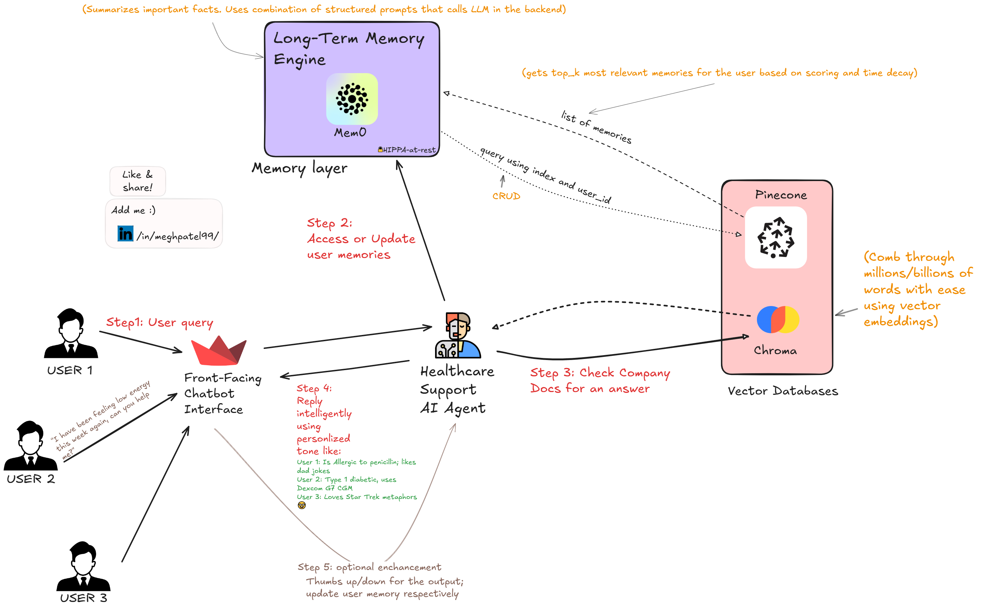

# Memory Chatbot 3004 – **HealthGPT Edition** 🩺🤖

> **Disclaimer** This demo is *not* a certified medical device. It offers informational support only and always reminds users to consult qualified healthcare professionals.

---

## 🖼️ Reference Architecture

> **

---

## 🚀 Overview

`HealthGPT` is a Streamlit‑powered chatbot that **remembers each user’s history** via vector embeddings (Pinecone) and dishes out healthcare‑flavoured answers with a hint of wit.  Long‑term memories live in Mem0; a YAML file (`prompts.yaml`) holds the system prompt so non‑coders can tweak the bot’s behaviour without touching Python.

| Stack                   | Why                                                 |
| ----------------------- | --------------------------------------------------- |
| **Streamlit**           | Quick chat UI with zero front‑end tears             |
| **OpenAI GPT‑4o‑mini**  | Core reasoning LLM                                  |
| **Mem0**                | Simple wrapper for long‑term memory CRUD            |
| **Pinecone Serverless** | Vector storage (1536‑dim embeddings)                |
| **YAML**                | Externalised system prompt (non‑dev‑friendly edits) |

---

## ✨ Features

* **User‑specific long‑term memory** – retrieves top‑K nuggets from Mem0 and writes the *last 5 chat bubbles* back after every turn (batched, non‑blocking).
* **Continuous context** – sends up to the *20 most recent messages* to GPT‑4o‑mini so the conversation never loses its thread.
* **Async OpenAI calls** – leverages `AsyncOpenAI` + a thread‑pool for faster, non‑blocking responses in Streamlit.
* **Healthcare guardrails** – goal & safety instructions live in `prompts.yaml`; tweak them without touching Python.
* **Hot‑reloadable prompts** – edit `prompts.yaml`, save, refresh the browser—changes apply instantly via `st.cache_data`.
* **Streamlit niceties** – dark‑mode‑friendly chat bubbles, sidebar controls, username switch, and memory‑expander for debugging.
* **Graceful memory batching** – messages queue until 5 are ready, then persist to Pinecone in one shot to reduce API chatter.


## 📂 Project structure

```
├── main.py            # Streamlit app (was app.py)
├── Images             # Images Folder
    ├──Long-term-memory.png         
├── prompts.yaml       # System prompt & background‑task spec
├── requirements.txt   # Python deps
└── README.md          # You’re here

```

---

## 🛠️ Prerequisites

* Python **3.10+**
* Valid **OpenAI API key**
* Valid **Pinecone API key** (serverless)
* Suggested: virtualenv (venv, pipenv, poetry)

---

## 🔧 Installation

```bash
# 1. Clone & step inside
git clone <github repo link>
cd healthgpt-chatbot


# 2. Create & activate virtual env
python -m venv .venv

MACOS: source .venv/bin/activate  
Windows: .venv\Scripts\activate

# 3. Install deps
pip install uv 
uv pip install -r requirements.txt #Neat trick for blazing fast package management

# 4. Create .env file
cp .env-example .env # Macos
copy .env-example .env # Windows
```
---

## 🔐 Configuration

Edit the **.env** in the project root:

```ini
OPENAI_API_KEY=sk-•••
PINECONE_API_KEY=•••
```

Tweaks:

* **Collection name** / embedding dims – see `main.py > memory_store` config.
* **System prompt** – edit `prompts.yaml`; save & refresh.

---

## 🏃‍♂️ Running locally

```bash
streamlit run main.py
```

Visit [http://localhost:8501](http://localhost:8501) and pick a username.
